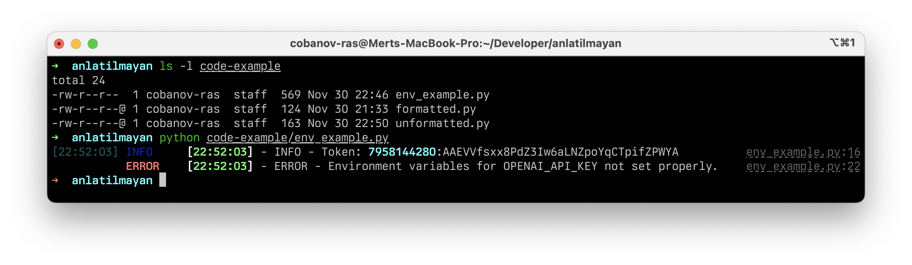
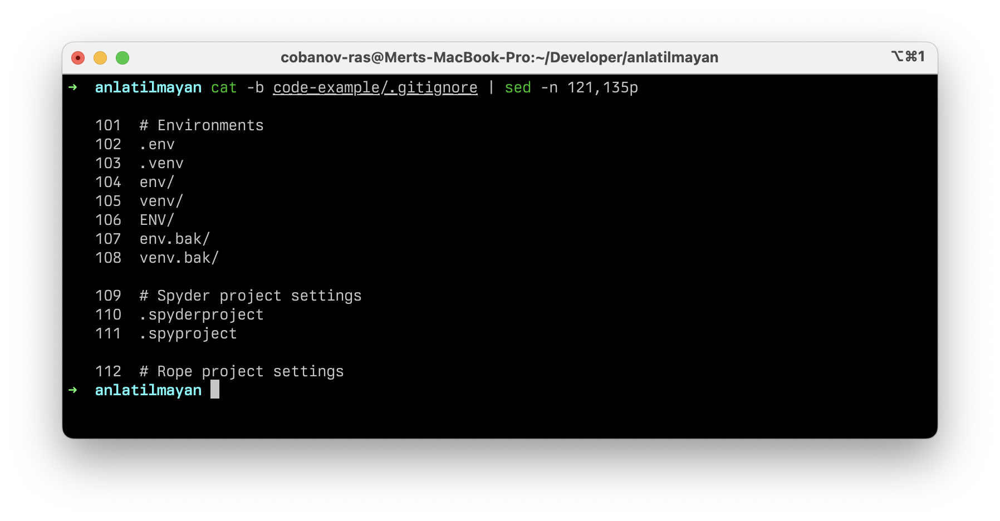

# Environment Variables

Yazılımcılar çoğu zaman API keyleri, şifreler veya diğer hassas bilgiler gibi gizli tutulması gereken bilgilerle çalışması gerekir. Bu bilgilerin güvenli ve etkili bir şekilde yönetilmesi, yetkisiz erişim veya sızıntıları önlemek için çok önemlidir.

Python'da kimlik bilgilerinizi yönetmek için kullanılan `python-dotenv` kütüphanesi bu sebeple kullanılır. Bu derste, `python-dotenv`'in temellerini ve bu kütüphanenin gizli kalması gereken bilgilerinizi kolaylıkla yönetmenize nasıl yardımcı olabileceğini anlatacağım.

**python-dotenv,** hassas verilerinizi kaynak kodunuzdan ayrı bir şekilde tutmanıza olanak tanıyan bir kütüphanedir. Çevre değişkenleri kullanarak kimlik bilgilerinizi yönetmenizi sağlar, bu da onları güvenli bir şekilde saklamanıza ve gerektiğinde kolayca erişmenize yardımcı olur. Bu yöntem, kimlik bilgilerinizi doğrudan kodunuzda saklamaktan çok daha güvenlidir ve yanlışlıkla bu bilgilerin kamu ortamına sızmasını önler.

## Kurulum

```bash
pip install python-dotenv
```

## Kullanım

Once you have installed python-dotenv, you can create a .env file in your project directory to store your environment variables. A .env file is a plain text file that contains a list of key-value pairs in the format KEY=VALUE. Each key-value pair represents an environment variable that you want to set.

For example, let’s say you have an **API key** that you want to use in your **Python** script. You can store the API key in your `.env` file like this:

```ini title=".env"
# .env file example

TOKEN="7958144280:AAEVVfsxx8PdZ3Iw6aLNZpoYqCTpifZPWYA"
```

``` py title="env_example.py"
# simple python script using dotenv

import logging
import os
import sys

from dotenv import load_dotenv
from rich.logging import RichHandler

LOG_FORMAT = "%(asctime)s - %(levelname)s - %(message)s"
logging.basicConfig(
    level="NOTSET", format=LOG_FORMAT, datefmt="[%X]", handlers=[RichHandler()]
)

load_dotenv()

TOKEN = os.getenv("TOKEN")
logging.info(f"Token: {TOKEN}")

try:
    OPENAI_API_KEY = os.environ["OPENAI_API_KEY"]
    logging.info("OPENAI_API_KEY retrieved successfully.")
except KeyError:
    logging.error("Environment variables for OPENAI_API_KEY not set properly.")
    sys.exit(1)
```



```bash
$ python env_example.py

# [22:46:27] - INFO - Token: 7958144280:AAEVVfsxx8PdZ3Iw6aLNZpoYqCTpifZPWYA
# [22:46:27] - ERROR - Environment variables for OPENAI_API_KEY not set properly.
```

**python-dotenv**, gizli kalması gereken keyleri güvende tutmak için vardır ve kodunuzda kazara hassas bilgi maruziyetini önleyebilirsiniz. `.env` dosyası genellikle `.gitignore` içine eklenir. Bu, hassas verilerin yanlışlıkla bir repoya push etmenizi önler.

## .gitignore

**Git** sürüm kontrol sisteminin takip etmesini istemediğiniz dosya ve dizinleri belirtir. Bu dosyada belirtilen dosyalar, **Git** tarafından yok sayılır ve depoya yüklenmez. Hassas verileri içeren veya gereksiz dosyaları ***(örn. geçici dosyalar, virtual environmentlar, log dosyaları veya .env)*** repoya eklememek için kullanılır.

Python için oluşturulmus bir `.gitignore` dosyasının 100 ve 113. satırları arasındaki dışlanan `.env` dosyalarını görebilirsiniz.



## Further Readings & Sources

- <https://medium.com/@c17hawke/unlock-secrets-to-managing-your-credentials-with-python-dotenv-quickstart-guide-5e0e34cd5c9a>
- <https://medium.com/@daryl-goh/working-with-environment-variables-in-python-using-dotenv-5800d458f71a>
