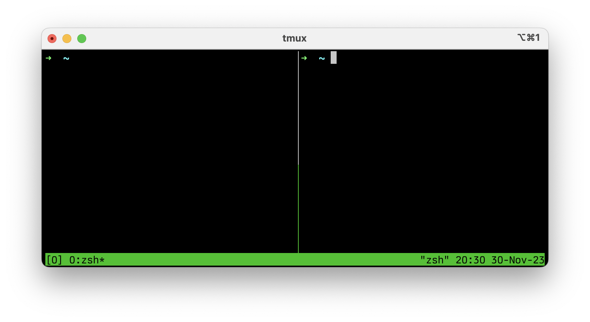

# tmux

**tmux** bir terminal çoklayıcısıdır ve özellikle uzun süren veya çoklu terminal oturumlarını yönetirken kullanırız. Bu araç, kullanıcıların birden fazla terminal seansını tek bir arayüzde yönetmelerine olanak tanır. Özellikle birden çok göreve aynı anda odaklanmanız gerektiğinde, iş akışınızı büyük ölçüde kolaylaştırmaya yarar.

Önemli bir özelliği, tmux oturumlarının bağlantı kesilse bile korunmasıdır. Yani, bir sunucuyla uzaktan çalışırken bağlantınız kesilirse, tmux oturumunuz arka planda çalışmaya devam eder ve bağlantıyı yeniden kurduğunuzda kaldığınız yerden devam edebilirsiniz. Bu, özellikle kararsız internet bağlantıları olan veya uzun süreli komutlar çalıştırdığımızda olduka işe yarıyor.


## tmux'a neden ihtiyacım olur?

tmux, özellikle uzak oturumları yönetirken veya bir terminal ortamında birden fazla görevde gitgel yaparken, komut satırı işleriniz için güçlü, esnek ve dayanıklı bir kontrol merkezi gibi çalışır.

- **Çoklu Pencereler:** tmux, tek bir terminal penceresi içinde birden çok pencere açmanıza olanak tanır. Bu, lokal makinenizde olduğu gibi birden fazla terminal sekmesi açamayacağınız bir uzak sunucuda çalışırken özellikle faydalıdır.

- **Sessions and Detaching:** Bir tmux oturumundan ayrılabilir ve onu arka planda çalışır durumda bırakabilirsiniz. Bu, bir tmux oturumu içinde uzun süreli bir işlem başlatabilir, ondan ayrılabilir ve sonra, farklı bir bilgisayardan bile, daha sonra yeniden bağlanabilirsiniz. Bu, uzun süren görevler için uzak sunucularda kapanmayan bir oturum gibi değerlidir.

- **Persistent Sessions:** Bir sunucudan bağlantınız kesilirse (SSH bağlantısını kaybetmek gibi), tmux oturumunuzu aktif tutar. Tekrardan bağlanabilir ve hiçbir şey kaybetmeden kaldığınız yerden devam edebilirsiniz.

- **Split Panes:** tmux, terminal pencerenizi yatay ve dikey olarak birden fazla panele bölmektedir. Bu, birkaç komutun çıktısını aynı anda görebilmeniz, izleme, düzenleme veya birden fazla komut satırı uygulamasını yan yana çalıştırmanız için harikadır.

## Install tmux

*Source: <https://github.com/tmux/tmux/wiki/Installing>* [^1]

| Platform               | Install Command       |
|------------------------|--:--------------------|
| Arch Linux             | `pacman -S tmux`      |
| Debian or Ubuntu       | `apt install tmux`    |
| Fedora                 | `dnf install tmux`    |
| RHEL or CentOS         | `yum install tmux`    |
| macOS (using Homebrew) | `brew install tmux`   |
| macOS (using MacPorts) | `port install tmux`   |
| openSUSE               | `zypper install tmux` |

## Get Started with tmux

tmux kullanmaya başlamak için terminalinizde `tmux` yazın. Bu komut, bir tmux sunucusu başlatır ve varsayılan bir oturum oluşturur `(number 0)`

```shell
tmux
```


Bir tmux oturumundan ayrılmak için ++ctrl+b++ ardından ++d++ (detach) tuşlarına basın. Tmux, “prefix” kombinasyonuna basılarak tetiklenen bir dizi tuş keybindingleri (klavye kısayolları) kullanır. Varsayılan olarak, prefix `Ctrl+B` dir. Daha sonra, mevcut oturumdan ayrılmak için `D` (detach) tuşuna basın.

```shell
~ tmux ls

# 0: 1 windows (created Thu Nov 30 20:16:45 2023)
```


Aşağıdaki komut ile birlikte hali hazırda açmış olduğunuz bir session'ı yeniden adlandırabilirsiniz.

```shell
# tmux rename -t <target_session> <new_name>
~ tmux rename -t 0 cobanov
```

Bu noktada `SSH` bağlantınızı kesebilirsiniz yine de komut çalışmaya devam edecektir. İstediğinize mevcut tmux oturumuna yeniden bağlanarak kaldığınız yerden devam edebilirsiniz:

```shell
# tmux a -t <session_name>
~ tmux attach -t cobanov
```

As you can see, her sey oldugu yerinde devam ediyor.

## Managing Panes

Bir masaüstü ortamında nasıl pencereleriniz varsaö Tmux'ta panelleriniz vardır. Aynı pencereler gibi, bu paneller de birden fazla uygulamayla etkileşimde bulunmanızı sağlar ve benzer şekilde açılabilir, kapatılabilir, yeniden boyutlandırılabilir ve taşınabilir.

Standart bir masaüstün ortamından farklı olarak, bu paneller tüm terminale döşenmiştir ve çoğunlukla tmux kısayolları ile yönetilir. *(fare işlevselliği eklenebilir olsa da).* Yeni bir panel oluşturmak için ekranı yatay veya dikey olarak bölersiniz.[^2]

### Split pane vertically

```text
ctrl+b %
```



### Split pane horizontally

```text
ctrl+b "
```


### Moving between panels [^4]

```text
ctrl+b [arrow key]
```

tmux'ta tüm kısayol tuşlarını görmek için basitçe `bind-key ?` komutunu kullanın, benim durumumda bu `CTRL-B ?` olacaktır.

Lorem ipsum dolor sit amet, consectetur adipiscing elit.[^3]

## Further Reading & Sources

[^1]: <https://github.com/tmux/tmux>
[^2]: <https://gist.github.com/MohamedAlaa/2961058>
[^3]: <https://leanpub.com/the-tao-of-tmux/read>
[^4]: <https://medium.com/pragmatic-programmers/a-beginners-guide-to-tmux-7e6daa5c0154>
